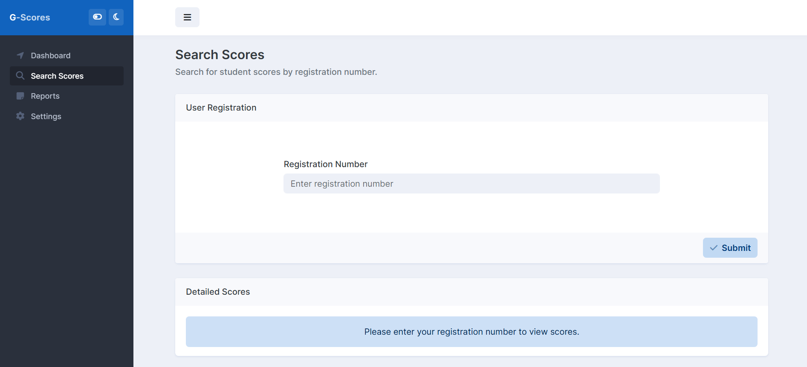
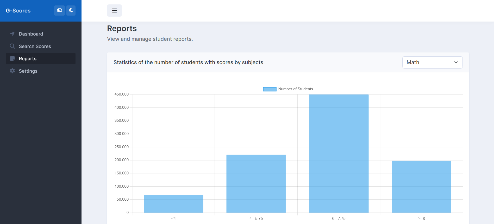
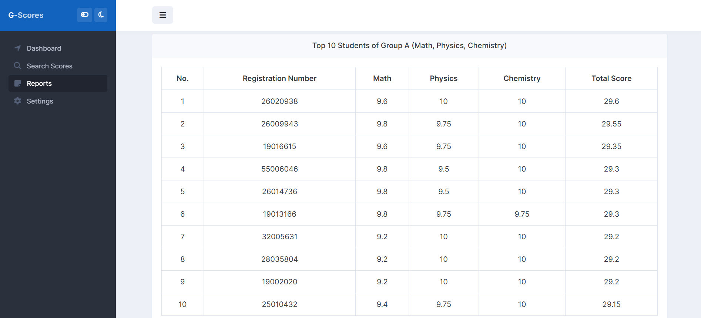

# G-Scores

G-Scores is a student score management system built with Laravel. It allows users to check scores by registration number, generate reports by score level, view statistics by subjects (charts), and list the top 10 students in Group A. The project includes seed data and can be run using Docker.

## 🌐 Demo online

You can access the live demo of G-Scores at: [https://g-scores-hd67.onrender.com/](https://g-scores-hd67.onrender.com/)

## 🚀 Main Features

1. Check scores by registration number – Users can enter a student's registration number to view their scores for each subject.

2. Score report by levels – Students are categorized into four levels:

    - ≥ 8
    - 8 > score ≥ 6
    - 6 > score ≥ 4
    - < 4

3. Statistics by subjects – Charts showing the number of students in each score level.

4. Top 10 students in Group A – Lists the top 10 students with the highest total scores in Math, Physics, and Chemistry.

## 🛠️ System Requirements

Before running the application, make sure your system has:

-   Docker & Docker Compose
-   PHP >= 8.1
-   Composer

## 📥 Installation and Running Locally

1. Clone the repository:

```bash
git clone https://github.com/Huchuynh/G-Scores.git
cd G-Scores
```

2. Install Composer

```bash
composer install --no-dev --optimize-autoloader
```

3. Copy the example environment file and fill in the necessary environment variables:

```bash
cp .env.example .env
```

4. Build and start Docker containers:

```bash
docker-compose up -d --build
```

5. Access the application in your web browser at `http://localhost:8000`.
    > Note: On first run, it may take a minute for migrations and seeders to finish before the web page is fully available.

## 🖼️ Screenshots

1. Search Scores Page
   

2. Score Reports Page

-   Statistics by subjects (charts)
    
-   Top 10 students in Group A
    

## 🎬 Demo Video

You can watch a demo of G-Scores here: [Demo Video](https://youtu.be/HGZFCD9uzv8)


